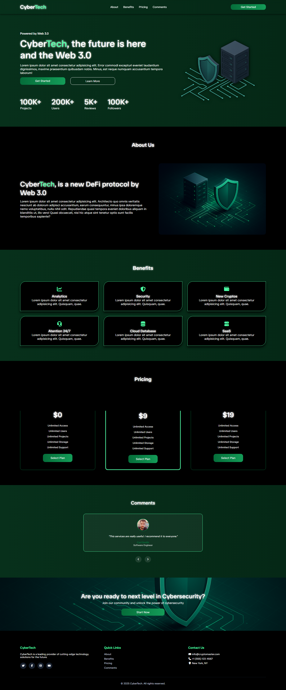

# 🌐 CyberTech Landing Page

CyberTech is a modern **landing page** built with **HTML, CSS, and JavaScript**, designed to showcase a futuristic Web 3.0 / Cybersecurity concept.  
The project was built in just **2 days** as part of a personal portfolio to demonstrate frontend skills and UI/UX design.

---

## ✨ Features

- 🚀 **Responsive Design** (works across devices)
- 🎨 **Modern UI** inspired by cybersecurity & Web 3.0
- 🟢 **Animated Gradient Background** for the hero section
- 🛡️ **Custom 3D Isometric Illustrations** (server & shield)
- 📊 **Animated Counters** for statistics
- 🔐 **Benefits, Pricing & Testimonials** sections
- 📎 **Reusable components** styled with pure CSS

---

## 🛠️ Tech Stack

- **HTML5** – semantic structure  
- **CSS3** – Flexbox, Grid, animations, custom gradients  
- **JavaScript (Vanilla JS)** – interactivity & DOM manipulation  

---

## 📂 Project Structure

├── index.html
├── css/
│ └── styles.css
│ └── responsive.css
├── js/
│ └── script.js
├── asset/
│ └── about.png
│ └── favicon.png
│ └── hero.png
│ └── section.png
│
└── README.md

